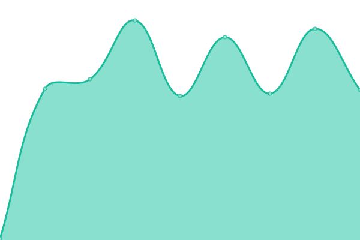
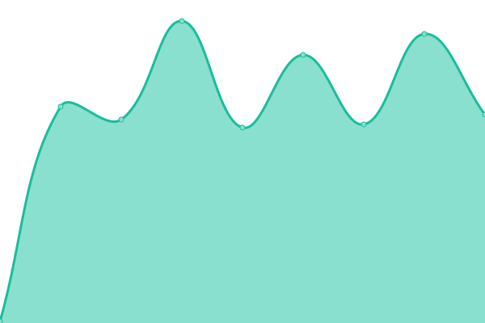

# [📈 Live Status](https://status.sas-media.ru): <!--live status--> **🟩 All systems operational**

This repository contains the open-source uptime monitor and status page for [Yaroslav G.](https://status.sas-media.ru), powered by [Upptime](https://github.com/upptime/upptime).

With [Upptime](https://upptime.js.org), you can get your own unlimited and free uptime monitor and status page, powered entirely by a GitHub repository. We use [Issues](https://github.com/yarik2720/upptime/issues) as incident reports, [Actions](https://github.com/yarik2720/upptime/actions) as uptime monitors, and [Pages](https://status.sas-media.ru) for the status page.

<!--start: status pages-->
<!-- This summary is generated by Upptime (https://github.com/upptime/upptime) -->
<!-- Do not edit this manually, your changes will be overwritten -->
<!-- prettier-ignore -->
| URL | Status | History | Response Time | Uptime |
| --- | ------ | ------- | ------------- | ------ |
|  [Noise FM FR Server](noisefm.ru) | 🟩 Up | [noise-fm-fr-server.yml](https://github.com/yarik2720/upptime/commits/HEAD/history/noise-fm-fr-server.yml) | 

 117ms
     
 | 

<a href="https://status.sas-media.ru/history/noise-fm-fr-server">100.00%</a>
    

|  [Noise FM](https://noisefm.ru) | 🟩 Up | [noise-fm.yml](https://github.com/yarik2720/upptime/commits/HEAD/history/noise-fm.yml) | 

 642ms
     
 | 

<a href="https://status.sas-media.ru/history/noise-fm">100.00%</a>
    

|  [Streams](https://play.sas-media.ru) | 🟩 Up | [streams.yml](https://github.com/yarik2720/upptime/commits/HEAD/history/streams.yml) | 

 694ms
     
 | 

<a href="https://status.sas-media.ru/history/streams">100.00%</a>
    

|  [Friendly Crowbar Synergy](noisefm.ru) | 🟩 Up | [friendly-crowbar-synergy.yml](https://github.com/yarik2720/upptime/commits/HEAD/history/friendly-crowbar-synergy.yml) | 

 119ms
     
 | 

<a href="https://status.sas-media.ru/history/friendly-crowbar-synergy">100.00%</a>
    

|  [Friendly Crowbar Black Mesa](noisefm.ru) | 🟩 Up | [friendly-crowbar-black-mesa.yml](https://github.com/yarik2720/upptime/commits/HEAD/history/friendly-crowbar-black-mesa.yml) | 

 116ms
     
 | 

<a href="https://status.sas-media.ru/history/friendly-crowbar-black-mesa">100.00%</a>
    

|  [SAS-Media SE Server](as2.sas-media.ru) | 🟩 Up | [sas-media-se-server.yml](https://github.com/yarik2720/upptime/commits/HEAD/history/sas-media-se-server.yml) | 

 158ms
     
 | 

<a href="https://status.sas-media.ru/history/sas-media-se-server">100.00%</a>
    

|  [Torrserver](torrserver.ev1.sas-media.ru) | 🟩 Up | [torrserver.yml](https://github.com/yarik2720/upptime/commits/HEAD/history/torrserver.yml) | 

 145ms
     
 | 

<a href="https://status.sas-media.ru/history/torrserver">99.66%</a>
    

|  [Jackett](jackett.ev1.sas-media.ru) | 🟩 Up | [jackett.yml](https://github.com/yarik2720/upptime/commits/HEAD/history/jackett.yml) | 

 143ms
     
 | 

<a href="https://status.sas-media.ru/history/jackett">99.83%</a>
    

<!--end: status pages-->

[**Visit our status website →**](https://status.sas-media.ru)

## 📄 License

- Powered by: [Upptime](https://github.com/upptime/upptime)
- Code: [MIT](./LICENSE) © [Anand Chowdhary](https://anandchowdhary.com), supported by [Pabio](https://pabio.com)
- Data in the `./history` directory: [Open Database License](https://opendatacommons.org/licenses/odbl/1-0/)
